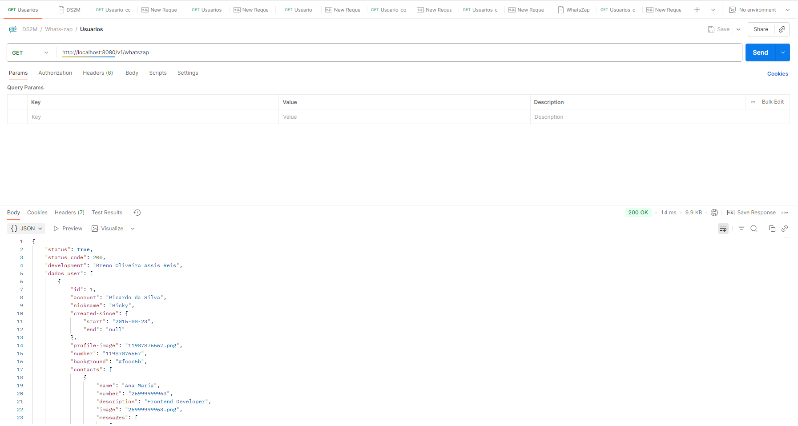
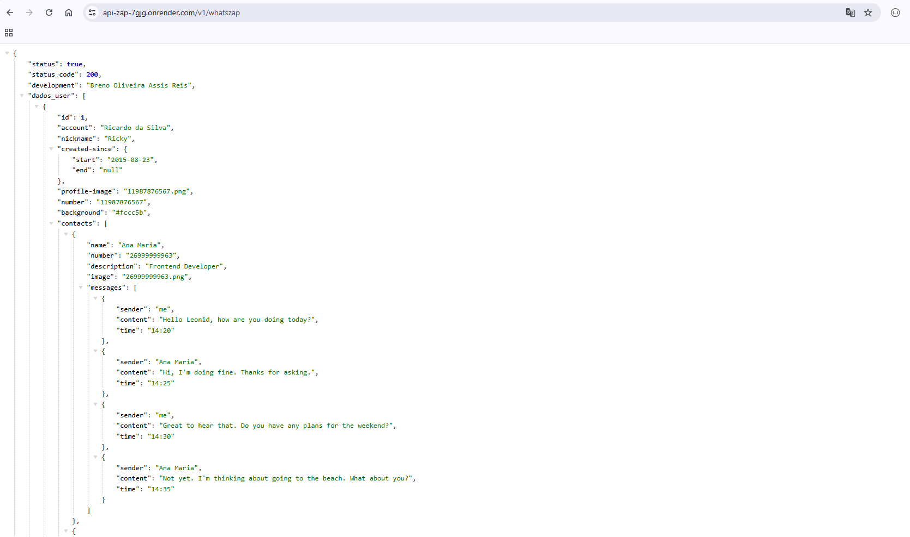

# API - WhatsZap  

## Sobre  
A **API do WhatsZap** foi desenvolvida na disciplina de **Back-end** como uma atividade proposta pelo professor **Marcel**, com o objetivo de praticar a criação de métodos do tipo **GET**.  

A API foi construída a partir de um **arquivo de texto** que contém informações de **usuários, contatos e mensagens**, servindo como base para o tratamento e retorno dos dados.  

---

## Tecnologias Utilizadas  
- **Node.js** → ambiente de execução para JavaScript no lado do servidor.  
- **Express.js** → framework para criação e gerenciamento das rotas HTTP.  
- **Postman** → utilizado para testar os endpoints localmente.  
- **Render** → plataforma utilizada para hospedar e rodar a API na web.  

---

## Imagens  
### Postman - rodando localmente  
  

### Render - rodando na web  
  

---

## Descrição da API  

A API do **WhatsZap** disponibiliza diversos endpoints para consultar usuários, contatos e mensagens.  
Abaixo está a descrição de cada rota e seu funcionamento:  

---

### 1. **Listar todos os usuários**  
**Rota:** `GET /v1/whatszap`  
**Descrição:** Retorna a lista completa de usuários cadastrados no sistema.  

---

### 2. **Buscar informações de um usuário**  
**Rota:** `GET /v1/whatszap/:user`  
**Parâmetro de rota:**  
- `:user` → identificador único do usuário (ex.: número de telefone ou nickname).  

**Descrição:** Retorna as informações de um usuário específico com base no identificador fornecido.  

---

### 3. **Listar contatos de um usuário**  
**Rota:** `GET /v1/whatszap/contatos/:telefone`  
**Parâmetro de rota:**  
- `:telefone` → número de telefone do usuário.  

**Descrição:** Retorna todos os contatos vinculados ao usuário informado.  

---

### 4. **Listar todas as mensagens de um usuário**  
**Rota:** `GET /v1/whatszap/contatos/mensagem/:telefone`  
**Parâmetro de rota:**  
- `:telefone` → número de telefone do usuário.  

**Descrição:** Retorna todas as mensagens enviadas e recebidas por um usuário.  

---

### 5. **Listar mensagens entre usuário e um contato específico**  
**Rota:** `GET /v1/whatszap/contato/mensagens`  
**Parâmetros de query:**  
- `telefone` → número do usuário.  
- `contato` → número do contato.  

**Descrição:** Retorna todas as mensagens trocadas entre um usuário e um contato específico.  

---

### 6. **Buscar mensagens por palavra-chave**  
**Rota:** `GET /v1/whatszap/contato/palavra-chave`  
**Parâmetros de query:**  
- `telefone` → número do usuário.  
- `contato` → número do contato.  
- `palavra` → termo a ser pesquisado dentro das mensagens.  

**Descrição:** Retorna mensagens filtradas com base em uma palavra-chave enviada entre um usuário e determinado contato.  

---
### 7. **Documento postman**
https://documenter.getpostman.com/view/45280553/2sB3QFQXjb
## Inicialização da API  
Para iniciar a API localmente, execute:  

```bash
node app.js
```
## Autor
[Breno Oliveira Assis Reis](https://www.linkedin.com/in/breno-oliveira-assis-reis-203010351/)